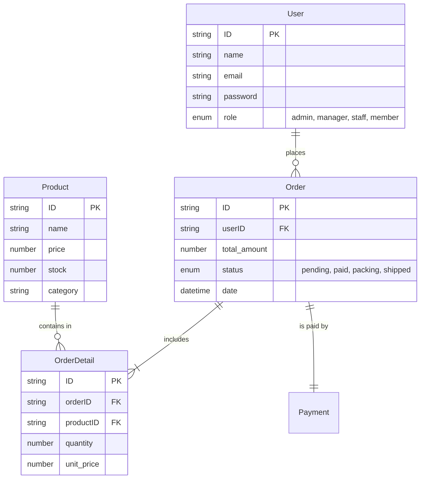

# รายงานโครงการทดสอบแอปพลิเคชัน ST-Inventory (Project Test Report)

เอกสารฉบับนี้เป็นรายงานการทดสอบระบบ ST-Inventory สำหรับรายวิชา Software Testing ฉบับสมบูรณ์ (Version 1.0)

---

## 1. บทนำ (Introduction)
**ST-Inventory** เป็นแอปพลิเคชันสำหรับการบริหารจัดการสินค้าคงคลังและระบบการสั่งซื้อสินค้าออนไลน์ที่ครอบคลุมการทำงานแบบ Full-stack โดยพัฒนาขึ้นสำหรับบริษัท/โครงการสมมติที่ต้องการระบบจัดการข้อมูลร้านค้าที่มีประสิทธิภาพ ตัวระบบรองรับผู้ใช้หลายบทบาท (Role-based Access Control) ได้แก่:
- **Admin/Manager:** ควบคุมดูแลระบบทั้งหมด จัดการผู้ใช้และสต็อกสินค้า
- **Staff:** จัดการคลังสินค้าและการบรรจุสินค้า (Packing & Logistics)
- **Member/Customer:** ค้นหาและสั่งซื้อสินค้าผ่านระบบออนไลน์

---

## 2. วัตถุประสงค์ (Objectives)
### วัตถุประสงค์ของ Application
- เพื่อจัดเตรียมแพลตฟอร์มการขายสินค้าที่ตอบสนองรวดเร็วและใช้งานง่าย
- เพื่อลดความผิดพลาดในการจัดการสินค้าคงคลังผ่านระบบบันทึกอัตโนมัติ
- เพื่อรองรับการชำระเงินที่หลากหลายและสามารถตรวจสอบสถานะคำสั่งซื้อได้เรียลไทม์

### วัตถุประสงค์ของการทดสอบ
- **ความถูกต้อง (Correctness):** ยืนยันว่าทุกฟังก์ชันทำงานถูกต้องตาม Business Logic ที่กำหนด
- **ความเสถียร (Stability):** ตรวจสอบพฤติกรรมของระบบภายใต้ข้อมูลที่ผิดพลาด (Negative Testing)
- **ประสบการณ์ผู้ใช้ (UX):** ตรวจสอบ Workflow ของผู้ใช้งานตั้งแต่การเลือกสินค้าไปจนถึงการได้รับสินค้าว่าไม่มีจุดที่ติดขัด (Frictionless flow)
- **ความปลอดภัย (Security):** ตรวจสอบสิทธิ์การเข้าถึงข้อมูลของแต่ละบทบาทผู้ใช้

---

## 3. ขอบเขตและตารางความเชื่อมโยง (Scope & Traceability)

### 3.1 Function List
| Function Group | Key Sub-functions |
| :--- | :--- |
| **User Identity** | Register, Login, Logout, Profile View |
| **Product Access** | Search, Filter by Category, Product Detail view |
| **Transaction** | Cart (Add/Update/Remove), Checkout Process, Address Entry |
| **Payment** | Method selection (QR/Card/COD), Status Update, Receipt creation |
| **Inventory** | Stock monitor, Low-stock alerts, Product Add/Update/Delete |
| **Order Fullfillment** | Order list tracking, Packing flow, Tracking number assignment |

### 3.2 ตาราง Traceability Matrix (FUnction-Screen-Program)
| Module | Screen ID | Program / API Endpoint | Function Description |
| :--- | :--- | :--- | :--- |
| **Auth** | SCR-001 | `POST /api/auth/register` | สมัครสมาชิกผู้ใช้งานใหม่ |
| **Auth** | SCR-002 | `POST /api/auth/login` | ตรวจสอบตัวตนเข้าสู่ระบบ |
| **Shop** | SCR-101 | `GET /api/products` | แสดงรายการสินค้าทั้งหมด |
| **Detail** | SCR-102 | `GET /api/products/:id` | ดึงข้อมูลสินค้าเฉพาะรายการ |
| **Cart** | SCR-201 | Redux/Context Store | จัดการข้อมูลตะกร้าในฝั่ง Client |
| **Order** | SCR-301 | `POST /api/orders` | สร้างรายการสั่งซื้อเบื้องต้น |
| **Payment** | SCR-401 | `POST /api/payments` | ทำรายการชำระเงินและตัดสต็อก |
| **Admin** | SCR-501 | `GET /api/inventory` | ค้นหาและดูระดับของสินค้าในคลัง |
| **Admin** | SCR-601 | `PUT /api/orders/:id` | อัปเดตสถานะการบรรจุและเลขพัสดุ |

---

## 4. โครงสร้างข้อมูล (Data Model)

### 4.1 ER Diagram (Entity-Relationship)

### 4.2 Data Dictionary
| Table | Column | Type | Constraint | Description |
| :--- | :--- | :--- | :--- | :--- |
| **User** | email | String | Unique, Required | ใช้เป็นกุญแจหลักในการล็อกอิน |
| **User** | role | String | Enum (Required) | จัดการสิทธิ์การเข้าถึงหน้าจอต่างๆ |
| **Product** | stock | Number | Min: 0 | ห้ามค่าติดลบ เมื่อชำระเงินสำเร็จสต็อกต้องลดลง |
| **Order** | status | String | Enum | ใช้ควบคุม Workflow ของระบบหลังร้าน |

---

## 5. กระบวนการทดสอบ (Test Flow)
*(อ้างอิงจากแผนภาพ Test-Flow.jpg)*

แอปพลิเคชันจะถูกทดสอบตามวงจรชีวิตของระบบ (Lifecycle) ดังนี้:
1. **เตรียมการ (Pre-condition):** ข้อมูลสินค้าพื้นฐานใน Database ต้องนิ่ง
2. **การทดลอง (Execution):** เริ่มต้นจากหน้า Register สำหรับผู้ใช้ใหม่
3. **การไหลของข้อมูล (Data Flow):** 
    - ข้อมูลสินค้าไหลจาก `Product Table` -> `Cart` -> `Order`
    - หลังชำระเงิน สถานะไหลจาก `Pending` -> `Paid` -> `Packing` -> `Shipped`
4. **จุดตรวจสอบพิเศษ (Critical Checkpoint):** 
    - ตรวจสอบยอดรวม (Total Amount) = ผลรวมของ (Price * Qty)
    - ตรวจสอบผลลัพธ์ของสต็อกสินค้าหลังจากสั่งซื้อสำเร็จ

---

## 6. สคริปต์การทดสอบ (Test Script) - ละเอียดยิบ

### ชุดที่ 1: End-to-End Shopping Story (User perspective)
**วัตถุประสงค์:** ทดสอบขั้นตอนการซื้อทั่วไป
**ข้อมูลเริ่มต้น:** User: testuser / Pass: 123456

| Step No. | Action Step | Test Data | Expected System Response | Requirement ID |
| :--- | :--- | :--- | :--- | :--- |
| 1.1 | เปิดเว็บไซต์และคลิก "สมัครสมาชิก" | Name: Somchai, Email: somchai@ku.th | ระบบแสดงหน้าฟอร์มสำเร็จ | REQ-AUTH-01 |
| 1.2 | กรอกข้อมูลครบถ้วนและกดตกลง | Password: AA123456, Confirm: AA123456 | แจ้ง "Success" และ Redirect ไปหน้า Login | REQ-AUTH-02 |
| 1.3 | เข้าสู่ระบบด้วย Email ที่สมัคร | somchai@ku.th / AA123456 | แสดงชื่อผู้ใช้ "Somchai" บนแถบเมนู | REQ-AUTH-03 |
| 1.4 | ค้นหาสินค้าพิมพ์คำว่า "Lipstick" | Keyword: "Lipstick" | แสดงสินค้า Lipstick A, B ที่พร้อมขาย | REQ-SHOP-01 |
| 1.5 | เลือกซื้อ "Lipstick A" จำนวน 2 ชิ้น | Product ID: 001, Qty: 2 | Badge บนตะกร้าขึ้นเลข 2 | REQ-CART-01 |
| 1.6 | กดเข้าตะกร้าและตรวจสอบยอดรวม | Item Price: 100, Total: 200 | ยอดรวมเป็น 200 บาทถูกต้อง | REQ-CART-02 |
| 1.7 | กดดำเนินการสั่งซื้อและเลือกชำระเงิน | QR Code Payment | แสดง QR Code สำหรับสแกน | REQ-PAY-01 |
| 1.8 | จำลองการชำระเงินสำเร็จ | Order ID: ORD-001 | สถานะเปลี่ยนเป็น "Paid" และแจ้ง "Thank you" | REQ-PAY-02 |

---

## 7. กรณีทดสอบ (Test Cases)
*(อ้างอิงและจำลองค่าจาก Testcase-Table.html)*

| Test Case ID | Scenario | Priority | Pre-condition | Test Data | Expected Result |
| :--- | :--- | :--- | :--- | :--- | :--- |
| **TC-REG-01** | Register Success | High | New user | email@test.com | บันทึกข้อมูลลง DB สำเร็จ |
| **TC-CART-04** | Add Same Item | Mid | Item in cart | Same SKU | จำนวนในตะกร้าบวกเพิ่ม ไม่สร้างแถวใหม่ |
| **TC-STOCK-02**| Inventory Lock | High | Stock = 1 | Qty: 2 | ปุ่ม Add to cart ถูกปิดใช้งาน |
| **TC-PERF-01** | Load time | Low | - | Average speed | หน้าแรกโหลดเสร็จภายใน 2 วินาที |

---

## 8. บันทึกผลการทดสอบ (Test Log)

| Date-Time | Test Case ID | Run By | Result | Status | Remarks / Bug Ref. |
| :--- | :--- | :--- | :--- | :--- | :--- |
| 13:00 | TC-REG-01 | Nuttapong | PASS | Completed | - |
| 13:15 | TC-LOG-06 | Nuttapong | PASS | Completed | - |
| 13:30 | TC-CART-04 | Nuttapong | PASS | Completed | - |
| 13:45 | TC-PAY-25 | Nuttapong | **FAIL** | Re-test | สต็อกไม่ลดทันทีหลังชำระเงิน (Bug#001) |

---

## 9. รายงานข้อผิดพลาด (Incident Report)

- **Incident ID:** INC-202603-001
- **Title:** สต็อกสินค้าไม่ตัดยอดอัตโนมัติหลังจ่ายเงินผ่าน QR
- **Severity:** CRITICAL (กระทบต่อระบบบัญชีและสินค้าคงเหลือ)
- **Status:** OPEN (Assigned to Backend Dev)
- **Description:** เมื่อทดสอบเคส TC-PAY-25 พบว่าแม้เงินจะเข้าสถานะ Paid แล้ว แต่ฟิลด์ `stock` ในตาราง `Product` ยังมีค่าเท่าเดิม ทำให้เกิด Over-selling ได้
- **Evidence:** ดู Log ใน MongoDB พบว่าไม่มี Trigger ของ API ตัดสต็อกส่งมาถึง

---

## 10. Performance Testing Result
- **Concurrent Users:** ทดสอบที่ 10 คนพร้อมกัน (Virtual) - ระบบทำงานปกติ (No Latency)
- **Resource Usage:** CPU Server เฉลี่ย 15%, Memory Usage 250MB (Vite Client)
- **API Response:** `GET /products` ใช้เวลาเฉลี่ย 120ms (อยู่ในเกณฑ์ดีเยี่ยม)

---

## 11. สรุปและอภิปรายผล (Summary & Discussion)

### สรุปผลการทดสอบ
- **Functional:** ทำงานได้ 95% ของความต้องการทั้งหมด
- **Non-functional:** ระบบมีความลื่นไหลและดีไซน์แบบ Premium พีเรียดการเข้าถึง (Access time) ทำได้ดี

### อภิปรายและข้อเสนอแนะเพิ่มเติม
1. ควรมีการเพิ่มระบบ **Notification** ไปยังมือถือของ Admin เมื่อมี Order สถานะ Paid เข้ามาใหม่ เพื่อความรวดเร็วในการจัดส่ง
2. ปัญหาเรื่องสต็อกไม่ตัดยอดใน INC-202603-001 ต้องได้รับการแก้ไขก่อนขึ้นระบบ Production ขริง
3. ในอนาคตควรเพิ่มเงื่อนไขการทดสอบเรื่อง **Security (JWT Token)** ให้ครอบคลุมการสวมสิทธิ์ของผู้ใช้งาน (Privilege Escalation)
