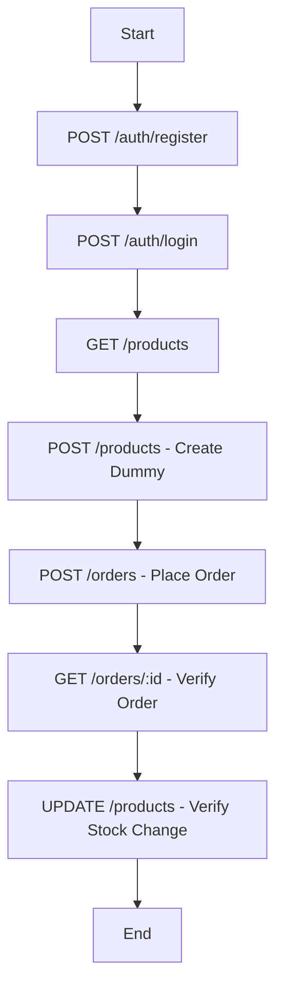

# Test Cases, Scripts, and Flow - ST-Inventory

This document outlines the testing strategy for the API endpoints.

## 1. Test Case Table

| ID | Module | Test Scenario | Input | Expected Result | Priority |
|---|---|---|---|---|---|
| TC-01 | Auth | Login with valid credentials | `{email: "valid@mail.com", password: "123"}` | `200 OK`, token returned | High |
| TC-02 | Auth | Login with invalid password | `{email: "valid@mail.com", password: "wrong"}` | `401 Unauthorized` | High |
| TC-03 | Product | Create product with missing price | `{name: "Test"}` | `400 Bad Request` | Medium |
| TC-04 | Product | Get all products | N/A | `200 OK`, list of products | High |
| TC-05 | Order | Create order with valid data | Valid order object | `201 Created`, Order + Payment | High |
| TC-06 | User | Update user role to 'admin' | `{role: "admin"}` | `200 OK`, updated role | Medium |

---

## 2. Test Scripts (Sample using Postman/Newman or Javascript)

### 2.1 Sample script for TC-01 (Login)
```javascript
// Example using a tool like Postman
pm.test("Status code is 200", function () {
    pm.response.to.have.status(200);
});

pm.test("Token is present", function () {
    var jsonData = pm.response.json();
    pm.expect(jsonData).to.have.property('token');
});
```

### 2.2 Sample script for TC-03 (Invalid Product)
```javascript
pm.test("Status code is 400", function () {
    pm.response.to.have.status(400);
});
```

---

## 3. Test Flow (API Sequence)

The typical flow for testing the inventory system:



1.  **Authentication Flow**: Register a new user followed by a Login to get the JWT token (mocked).
2.  **Inventory Setup**: List products, then add a new product.
3.  **Transaction Flow**: Place an order using the created product.
4.  **Verification**: Retrieve the order details and check if the stock of the product was reduced (noting: current logic doesn't auto-decrement stock, this is a test point for future implementation).
5.  **Cleanup**: Delete the test product and user.
